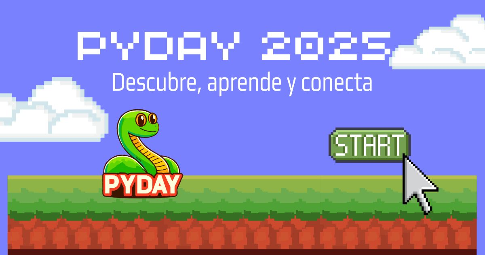

# 🐍 PyDay Chile Website Frontend



**The official frontend for PyDay Chile** - A community-driven Python conference showcasing Chile's tech talent through talks, workshops, and networking events across multiple cities.

## ✨ Key Features

### 📍 Multi-City Experience
- Dynamic content routing for different conference locations
- Interactive map showing participating cities
- City-specific schedules and venue information

### 📸 Multimedia Hub
- Responsive image gallery with lazy loading
- Full-screen modal viewer with keyboard navigation
- Organized historical content by year/location
- Embedded video section with responsive players

### 🚀 Modern Web Practices
- Next.js 13+ App Router implementation
- Optimized WebP image delivery
- Responsive UI with Tailwind CSS
- Accessibility-first components (ARIA labels, keyboard nav)

### 🎤 Event Features
- Speaker profiles with social links
- Interactive schedule with filtering
- Sponsor showcase with tiered visibility
- Registration form with validation

## 🛠 Tech Stack

**Core**  
  
  


**Optimization**  
  
  


**Interactive**  
  


## 📂 Project Structure

```bash
pyday-frontend/
├── public/            # Optimized static assets
│   └── images/        # Organized media library
│       ├── gallery/   # Event photos by year/city
│       ├── speakers/  # Speaker headshots
│       └── sponsors/  # Partner logos
│
├── src/
│   ├── app/           # Next.js 13+ routing
│   ├── components/    # Reusable UI elements
│   ├── data/          # Content management
│   └── lib/           # Utilities & helpers
│
└── tailwind.config.js # Custom design system
```


## 🖼 Image Optimization

| Feature                | Implementation               | Benefit                          |
|------------------------|------------------------------|----------------------------------|
| **Modern Formats**     | WebP conversion              | 30% smaller than JPEG            |
| **Responsive SrcSet**  | Next.js Image component      | Device-appropriate sizes         |
| **Lazy Loading**       | Intersection Observer API    | Faster initial load              |
| **Blur Placeholders**  | Dynamic SVG generation       | Smooth loading experience        |

## ♿ Accessibility Commitment

- WCAG 2.1 AA compliant components
- Semantic HTML structure
- Keyboard-navigable interfaces
- Reduced motion preferences support
- ARIA labels for interactive elements

## 📌 Core Dependencies

- `next@15.3.1`: React framework for production
- `tailwindcss@4.1`: Utility-first CSS
- `framer-motion@10.16.0`: Smooth animations

## 🌍 Contributing

We welcome community contributions! Please see our [Contribution Guidelines](docs/CONTRIBUTING.md) and review our [Photography Style Guide](docs/guia-fotografia.md) for asset submissions.

---

**License**: Apache 2.0 (See [LICENSE](LICENSE))  
**Maintainer**: PyDay Chile Tech Committee  
📧 *pyday@pythonchile.cl*
